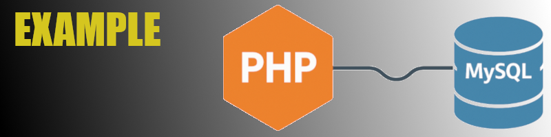

# Conexão Segura PHP com MySQL usando PDO

Este repositório contém exemplos de como estabelecer uma conexão segura com o banco de dados MySQL usando a extensão PDO (PHP Data Objects) em PHP. Ele demonstra as melhores práticas para realizar operações comuns como inserir, alterar e deletar registros, com foco na segurança contra SQL injection através de prepared statements.


## Conteúdo

O repositório inclui os seguintes arquivos:

* `connection.php`: Script responsável por estabelecer a conexão com o banco de dados MySQL usando PDO. Ele configura o tratamento de erros e define o modo de fetch padrão.
* `disconnect.php`: Script simples para demonstrar como "desconectar" do banco de dados, atribuindo `null` à variável da conexão PDO.
* `manipula_dados.php`: Um exemplo de script que inclui a conexão e demonstra como inserir, alterar e deletar dados de forma segura usando prepared statements e lógica condicional para determinar a ação a ser executada.

## Pré-requisitos

Antes de utilizar os scripts, certifique-se de ter o seguinte configurado:

* **PHP:** Uma versão do PHP 5.1 ou superior (preferencialmente uma versão mais recente para aproveitar os recursos mais recentes e melhorias de segurança). A extensão PDO MySQL deve estar habilitada na sua instalação do PHP.
* **MySQL:** Um servidor MySQL em execução e as credenciais de acesso (host, nome do banco de dados, usuário e senha) para o banco de dados que você deseja acessar.

## Configuração

1.  **Clone o repositório:**
    ```bash
    git clone [URL_DO_SEU_REPOSITORIO]
    ```

2.  **Configure o arquivo `connection.php`:**
    Abra o arquivo `connection.php` e edite as seguintes variáveis com as suas informações de conexão com o MySQL:
    ```php
    <?php
    $host = 'localhost'; // Seu host MySQL
    $dbname = 'seu_banco_de_dados'; // O nome do seu banco de dados
    $username = 'seu_usuario'; // Seu nome de usuário do MySQL
    $password = 'sua_senha'; // Sua senha do MySQL
    ```
    **Importante:** Mantenha estas informações seguras e evite hardcodificá-las diretamente em arquivos em ambientes de produção. Considere usar variáveis de ambiente ou arquivos de configuração separados.

3.  **Crie a tabela no MySQL (opcional para o exemplo `manipula_dados.php`):**
    Se você quiser testar o script `manipula_dados.php`, crie uma tabela no seu banco de dados MySQL (substitua `sua_tabela` e os nomes das colunas conforme necessário):
    ```sql
    CREATE TABLE sua_tabela (
        id INT AUTO_INCREMENT PRIMARY KEY,
        nome VARCHAR(255) NOT NULL,
        email VARCHAR(255)
    );
    ```

## Uso

1.  **Inclua o arquivo de conexão:**
    Em seus scripts PHP que precisam acessar o banco de dados, inclua o arquivo `connection.php`:
    ```php
    <?php
    require_once 'connection.php';

    // Agora você pode usar a variável $pdo para interagir com o banco de dados
    // Exemplo: $stmt = $pdo->query("SELECT * FROM sua_tabela");
    ?>
    ```

2.  **Utilize prepared statements para operações de banco de dados:**
    O arquivo `manipula_dados.php` demonstra como usar prepared statements para inserir, alterar e deletar dados de forma segura. Adapte essa lógica para as suas necessidades.

3.  **Desconexão (opcional):**
    Em scripts web típicos, a conexão é fechada automaticamente ao final da execução do script. O arquivo `disconnect.php` mostra como você pode explicitamente definir a variável `$pdo` como `null` para liberar a conexão.

## Boas Práticas e Segurança

* **Use Prepared Statements com PDO:** A forma mais segura de interagir com o banco de dados é utilizando prepared statements para prevenir ataques de SQL injection.
* **Tratamento de Erros:** Implemente blocos `try...catch` para lidar com possíveis erros de conexão e durante a execução das queries.
* **Validação de Dados:** Sempre valide e sanitize os dados recebidos do usuário antes de inseri-los ou utilizá-los em suas queries.
* **Segurança das Credenciais:** Proteja suas credenciais de banco de dados. Evite armazená-las diretamente no código em ambientes de produção.

## Portfólio

Este repositório demonstra as seguintes habilidades e conhecimentos:

* Conexão segura com bancos de dados MySQL em PHP.
* Utilização da extensão PDO.
* Implementação de prepared statements para segurança contra SQL injection.
* Organização de código em arquivos separados para conexão e desconexão.
* Boas práticas de desenvolvimento para interação com bancos de dados.

Sinta-se à vontade para utilizar e adaptar este código como parte do seu portfólio para demonstrar suas habilidades em desenvolvimento PHP e segurança de aplicações web.

## Licença

[ADICIONE A SUA LICENÇA AQUI, por exemplo, MIT License]

---

Sinta-se livre para copiar e colar este conteúdo no seu arquivo `README.md` e adaptá-lo conforme as suas necessidades e o desenvolvimento do seu projeto. Se tiver mais alguma dúvida ou precisar de alguma modificação neste README, é só me dizer! 😊
